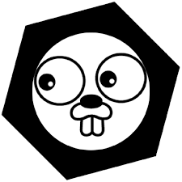

# corego

<!-- PROJECT SHIELDS -->
<!--
*** I'm using markdown "reference style" links for readability.
*** Reference links are enclosed in brackets [ ] instead of parentheses ( ).
*** See the bottom of this document for the declaration of the reference variables
*** for contributors-url, forks-url, etc. This is an optional, concise syntax you may use.
*** https://www.markdownguide.org/basic-syntax/#reference-style-links
-->
[![Contributors][contributors-shield]][contributors-url]
[![Forks][forks-shield]][forks-url]
[![Stargazers][stars-shield]][stars-url]
[![Issues][issues-shield]][issues-url]
[![MIT License][license-shield]][license-url]
[![LinkedIn][linkedin-shield]][linkedin-url]


<!-- PROJECT LOGO -->
<br />
<p align="center">
  <a href="https://github.com/kolbis/corego">
    
  </a>
  <h3 align="center">COREGO is a library built on top of GO-KIT for building microservices in GO</h3>
  <p align="center">
    <br />
    <a href="https://github.com/kolbis/corego"><strong>Explore the docs »</strong></a>
    <br />
    <br />
    <a href="https://github.com/kolbis/go-kit-user-ms-example">View Demo</a>
    ·
    <a href="https://github.com/kolbis/corego/issues">Report Bug</a>
    ·
    <a href="https://github.com/kolbis/corego/issues">Request Feature</a>
  </p>
</p>
 


<!-- TABLE OF CONTENTS -->
<!-- ## Table of Contents

- [corego](#corego)
  - [About The Project](#about-the-project)
    - [Built With](#built-with)
  - [Roadmap](#roadmap)
  - [Contributing](#contributing)
  - [License](#license)
  - [Contact](#contact)

<!-- ABOUT THE PROJECT -->
## About The Project

[GO-KIT](https://github.com/go-kit/kit) is one of the popular toolkit for building microservices in GO. It does a lot of heavy lifting when you get started. 

Go-Kit is opinionated in the way you need to structure your microservices (transport layer, endpoint layer and service layer) which ensures a common standard among the development teams. 

Out of the box, you are getting different integrations to tracing, logging, transporting, service discovery and metrics. 

Yet, while working with Go-Kit, I found there are still missing important concepts, such as:
- configuration management
- transporting context between microservices
- working with databases
- handling execution fallbacks
- working with errors

Corego tries to be more opinionated and focus on selected integrations:
- consul and coreDNS for service discovery
- consul as remote KV
- zap as logger
- prometheos and datadog for metrics
- zipkin for tracing
- cassandra, elastic, mongo for databases
- rabbit for amqp transport

[GO-KIT-USER-MS-EXAMPLE](https://github.com/kolbis/go-kit-user-ms-example) repo uses corego as an engine to create and run a real world microservice example

### Built With

* [GO-KIT](https://github.com/go-kit/kit)


<!-- GETTING STARTED -->
<!-- ## Getting Started

To get a local copy up and running follow these simple steps.

### Prerequisites

This is an example of how to list things you need to use the software and how to install them.
* npm
```sh
npm install npm@latest -g
``` -->

<!-- ### Installation

1. Clone the repo
```sh
git clone https://github.com/kolbis/corego.git
```
2. Install NPM packages
```sh
npm install
``` -->

<!-- USAGE EXAMPLES -->
<!-- ## Usage

Use this space to show useful examples of how a project can be used. Additional screenshots, code examples and demos work well in this space. You may also link to more resources.

_For more examples, please refer to the [Documentation](https://example.com)_ -->

<!-- ROADMAP -->
## Roadmap

See the [open issues](https://github.com/kolbis/corego/issues) for a list of proposed features (and known issues).

<!-- CONTRIBUTING -->
## Contributing

Contributions are what make the open source community such an amazing place to be learn, inspire, and create. Any contributions you make are **greatly appreciated**.

1. Fork the Project
2. Create your Feature Branch (`git checkout -b feature/AmazingFeature`)
3. Commit your Changes (`git commit -m 'Add some AmazingFeature'`)
4. Push to the Branch (`git push origin feature/AmazingFeature`)
5. Open a Pull Request

<!-- LICENSE -->
## License

Distributed under the MIT License. See `LICENSE` for more information.


<!-- CONTACT -->
## Contact

Guy Kolbis - [@GKolbis](https://twitter.com/GKolbis) - guyk@net-bet.net

Project Link: [https://github.com/kolbis/corego](https://github.com/kolbis/corego)

<!-- ACKNOWLEDGEMENTS -->
<!-- ## Acknowledgements

* []()
* []()
* []() -->


<!-- MARKDOWN LINKS & IMAGES -->
<!-- https://www.markdownguide.org/basic-syntax/#reference-style-links -->
[contributors-shield]: https://img.shields.io/github/contributors/kolbis/repo.svg?style=flat-square
[contributors-url]: https://github.com/kolbis/repo/graphs/contributors
[forks-shield]: https://img.shields.io/github/forks/kolbis/repo.svg?style=flat-square
[forks-url]: https://github.com/kolbis/repo/network/members
[stars-shield]: https://img.shields.io/github/stars/kolbis/repo.svg?style=flat-square
[stars-url]: https://github.com/kolbis/repo/stargazers
[issues-shield]: https://img.shields.io/github/issues/kolbis/repo.svg?style=flat-square
[issues-url]: https://github.com/kolbis/repo/issues
[license-shield]: https://img.shields.io/github/license/kolbis/repo.svg?style=flat-square
[license-url]: https://github.com/kolbis/repo/blob/master/LICENSE.txt
[linkedin-shield]: https://img.shields.io/badge/-LinkedIn-black.svg?style=flat-square&logo=linkedin&colorB=555
[linkedin-url]: https://linkedin.com/in/kolbis
[product-screenshot]: images/screenshot.png